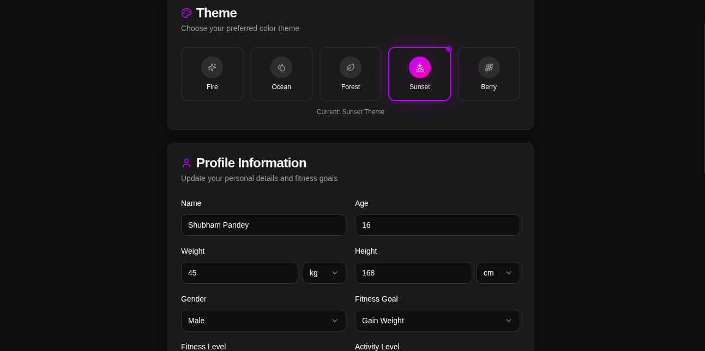

# FitGenius AI

FitGenius AI is your personal AI-powered fitness companion. It provides personalized workout plans, diet plans, and AI coaching to help you achieve your fitness goals.


## Features

### 🤖 AI-Powered Personalization
- **Smart Onboarding**: Collects your fitness goals, body measurements, and preferences
- **Personalized Workout Plans**: Custom weekly workout routines based on your profile
- **Customized Diet Plans**: Meal plans tailored to your dietary needs and goals

### 💬 AI Chat Coach
- Ask questions about workouts, nutrition, and fitness
- Get exercise form tips and recommendations
- Receive motivation and accountability support

### 📊 Progress Tracking
- Track your workouts and weight progress
- BMI calculator
- Visual progress charts and statistics

### 🎯 Key Stats Dashboard
- Goal tracking (Weight Loss, Gain, Maintenance, Muscle Building)
- BMI calculation
- Weight monitoring
- Workout completion counter

## How It Works

### 1. Onboarding
When you first open the app, you'll go through a 4-step onboarding process:

1. **Basic Info**: Enter your name, age, and gender
2. **Body Measurements**: Input your weight and height (supports kg/lbs and cm/ft)
3. **Fitness Goals**: Select your primary fitness goal and experience level
4. **Additional Details**: Specify available equipment and dietary preferences

### 2. Dashboard Overview
After onboarding, you'll see your personalized dashboard with:
- Quick stats (Goal, BMI, Weight, Workouts)
- Tab navigation to Workout, Diet, Progress, and AI Coach sections

### 3. Generate Plans
- **Workout Plan**: Click "Generate Plan" to create a personalized 7-day workout routine
- **Diet Plan**: Click "Generate Plan" to receive customized meal plans with macro breakdowns
- **AI Coach**: Chat with your AI fitness coach for any questions or advice

### 4. Track Progress
- Log your weight and workouts
- View progress over time with visual charts
- Update your profile anytime in Settings

## Tech Stack

- **Frontend**: React 18 + TypeScript
- **Build Tool**: Vite
- **Styling**: Tailwind CSS + shadcn/ui components
- **Backend**: Supabase (Edge Functions)
- **AI**: Google Gemini API (via Supabase Edge Functions)
- **State Management**: React Query + LocalStorage
- **Routing**: React Router DOM

## Getting Started

### Prerequisites
- Node.js 18+ and npm
- Supabase account (for backend)
- Google Gemini API key (optional - can use default Lovable AI gateway)

### Installation

1. Clone the repository:
```bash
git clone <your-repo-url>
cd ai-fit-buddy
```

2. Install dependencies:
```bash
npm install
```

3. Start the development server:
```bash
npm run dev
```

4. Open your browser and navigate to:
```
http://localhost:8080
```

### Environment Variables

Create a `.env` file in the root directory:

```env
VITE_SUPABASE_URL=your-supabase-url
VITE_SUPABASE_ANON_KEY=your-supabase-anon-key
```

## Supabase Setup

### 1. Create a Supabase Project
1. Go to [Supabase](https://supabase.com) and create a new project
2. Note your project URL and anon key

### 2. Set Up Edge Functions
1. In your Supabase dashboard, go to **Edge Functions**
2. Create a new function named `ai-trainer`
3. Copy the code from `supabase/functions/ai-trainer/index.ts`
4. Deploy the function

### 3. Configure Environment
Add your Supabase credentials to your environment variables.

## Deploying to Vercel

Vercel is the recommended platform for deploying this React application. Follow these steps:

### Option 1: Deploy via Vercel CLI

1. **Install Vercel CLI**:
```bash
npm i -g vercel
```

2. **Login to Vercel**:
```bash
vercel login
```

3. **Deploy**:
```bash
cd ai-fit-buddy
vercel
```

4. **Follow the prompts**:
   - Set up and deploy? → Yes
   - Which scope? → Select your account
   - Link to existing project? → No
   - Project name? → fitgenius-ai (or your preferred name)
   - Directory? → ./
   - Want to modify settings? → No (or Yes to configure)

### Option 2: Deploy via Vercel Dashboard

1. **Go to Vercel Dashboard**:
   - Visit [vercel.com](https://vercel.com) and sign in

2. **Add New Project**:
   - Click "Add New Project"
   - Select "Import Git Repository"
   - Choose your GitHub repository

3. **Configure Project**:
   - Framework Preset: `Vite`
   - Build Command: `npm run build`
   - Output Directory: `dist`
   - Root Directory: `.'

4. **Set Environment Variables**:
   Go to Project Settings → Environment Variables and add:
   ```
   VITE_SUPABASE_URL=your-supabase-url
   VITE_SUPABASE_ANON_KEY=your-supabase-anon-key
   ```

5. **Deploy**:
   - Click "Deploy"
   - Vercel will build and deploy your app

### Option 3: Deploy via Git Integration

1. **Push to GitHub**:
```bash
git add .
git commit -m "Initial commit"
git push origin main
```

2. **Connect to Vercel**:
   - Go to [vercel.com](https://vercel.com)
   - Click "Add New Project"
   - Import your GitHub repository
   - Configure as in Option 2

3. **Deploy**:
   - Every push to main will automatically trigger a new deployment

### Custom Domain (Optional)

1. In Vercel Dashboard, go to your project
2. Navigate to **Settings → Domains**
3. Click "Add Domain"
4. Enter your custom domain and follow the verification steps

## API Configuration

### Using Your Own Gemini API Key

You can use your own Google Gemini API key for AI features:

1. Open the app and go to Settings
2. Enter your Gemini API key in the API Key field
3. Save changes

### Supabase Edge Functions

The AI features are powered by Supabase Edge Functions:
- `ai-trainer`: Handles workout plans, diet plans, and chat requests
- Supports both default Lovable AI gateway and custom Gemini API keys
- Includes rate limiting and error handling

## Project Structure

```
ai-fit-buddy/
├── src/
│   ├── components/
│   │   ├── AIChat.tsx          # AI Coach chat interface
│   │   ├── Dashboard.tsx       # Main dashboard
│   │   ├── DietPlanView.tsx    # Diet plan display
│   │   ├── OnboardingForm.tsx  # User onboarding
│   │   ├── ProgressTracker.tsx # Progress logging
│   │   ├── Settings.tsx        # App settings
│   │   └── WorkoutPlanView.tsx # Workout plan display
│   ├── hooks/
│   │   ├── useLocalStorage.ts  # Local storage hook
│   │   └── useToast.ts         # Toast notifications
│   ├── integrations/
│   │   └── supabase/           # Supabase client
│   ├── pages/
│   │   └── Index.tsx           # Main page
│   ├── types/
│   │   └── fitness.ts          # TypeScript types
│   ├── App.tsx                 # App component
│   └── main.tsx                # Entry point
├── supabase/
│   └── functions/
│       └── ai-trainer/         # Edge Function
├── index.html                  # HTML entry
├── package.json
├── tailwind.config.ts
├── vite.config.ts
└── README.md
```

## Building for Production

To create a production build:

```bash
npm run build
```

The build output will be in the `dist` directory.

## Preview Production Build

To preview the production build locally:

```bash
npm run preview
```

## Contributing

1. Fork the repository
2. Create a feature branch (`git checkout -b feature/amazing-feature`)
3. Commit your changes (`git commit -m 'Add some amazing feature'`)
4. Push to the branch (`git push origin feature/amazing-feature`)
5. Open a Pull Request

## License

This project is licensed under the MIT License.

## Support

For issues and feature requests, please open a GitHub issue.

---

Built with ❤️ using React, TypeScript, Tailwind CSS, and AI

# Fit-Genius
